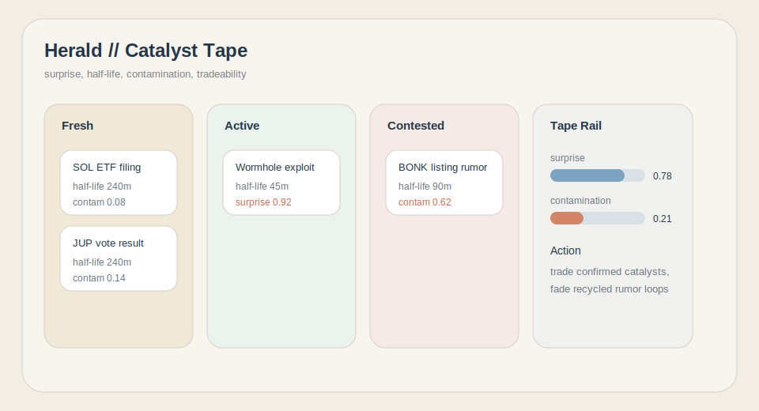
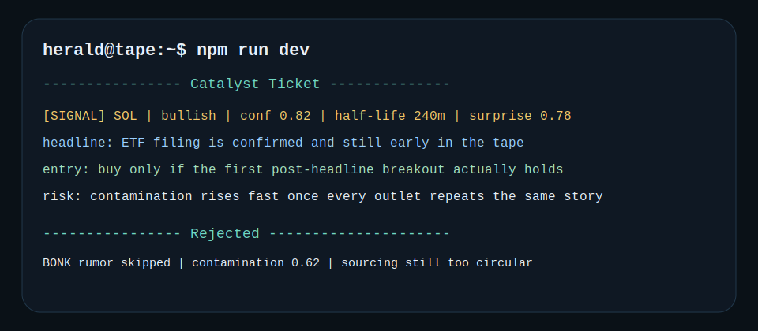

# Herald

Catalyst tape for crypto market events.

Herald scores whether a headline still has tradeable edge after publication. It focuses on surprise, event half-life, and contamination risk rather than generic sentiment labels.

[](https://github.com/HeraldAgent/Herald/actions)


## Catalyst Board



## Tape Ticket



## Technical Spec

Herald ranks news with three practical questions:

1. Is the event surprising?
2. How long does edge usually persist for this category?
3. How contaminated is the headline by rumor loops or recycled coverage?

### Event Half-Life

`hack = 45m`

`listing = 90m`

`regulation = 240m`

`unlock = 360m`

This governs how fast a signal decays in the tape.

### Contamination Score

Contamination rises when the item contains:
- rumor / unconfirmed language
- anonymous sourcing
- repeated social headlines
- too many token mentions in one story

Higher contamination reduces ranking and conviction.

### Ranking Heuristic

`impact = categoryWeight + abs(rawSentiment) * 2 - contaminationScore * 3`

This keeps strong structural catalysts above hype headlines.

## Quick Start

```bash
git clone https://github.com/HeraldAgent/Herald
cd Herald
npm install
cp .env.example .env
npm run dev
```

## Local Audit Docs

- [Commit sequence](docs/commit-sequence.md)
- [Issue drafts](docs/issue-drafts.md)

## License

MIT
